<div align="center">

# Fire >_

### Terminal fire animation written in Rust.
<p align="center">
  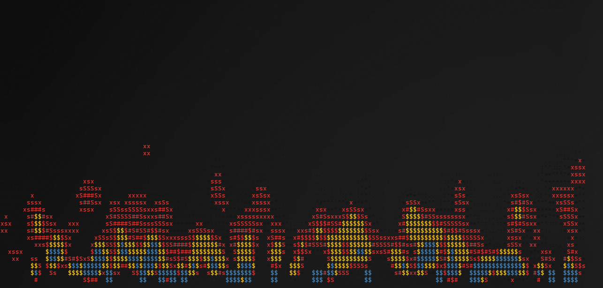
</p>
</div>

---

<div align="center">

### 🌐 Language / Язык

[🇷🇺 Русский](./russian_readme.md) &nbsp;·&nbsp; **[🇺🇸 English](./README.md)**

</div>

---

## ☁️ Overview

**Fire CLI** is an ultra-lightweight utility written in **Rust** that turns your terminal into a cozy fireplace. Thanks to direct buffer manipulation and zero heavy dependencies, the animation stays smooth even on the weakest hardware.

### Why is this cool?
* **OS-Agnostic**: Works anywhere Rust and `libc` are supported — Windows, macOS, Linux distros, or BSD.
* **Zero Logic Clutter**: All visuals are built on standard output streams, guaranteeing operation in minimalist environments.

---

## ✨ Key Features

| Feature | Description |
| :--- | :--- |
| **🎚️ Customization** | Full control over burn speed and flame intensity. |
| **🎨 Themes** | A set of preset color schemes — from classic fire to magical blue. |
| **🌚 Monochrome** | A dedicated mode for fans of classic ASCII art without color. |
| **🚀 Performance** | Minimal resource usage thanks to the efficient Rust engine. |

> [!TIP]
> **ASCII Engine**: The fire visualization is based on ANSI escape sequences. For a perfect gradient, your terminal must support 24-bit color (TrueColor).

---

## 💻 Terminal Compatibility

On legacy systems (Windows 10 and below), standard consoles like `cmd.exe` or `PowerShell.exe` often struggle with intensive dynamic output, causing several visual issues:

* ⚠️ **Artifacts**: "Garbage" control characters like `←[0K` appearing on top of the animation.
* 📉 **Tearing**: Slow stream processing causes noticeable frame tearing and flickering.
* 🚫 **TrueColor issues**: Older consoles do not support 24-bit color.

**For a flawless picture, use any modern terminal with Virtual Terminal (VT) Sequence support:**

* 🎨 **Recommended:** [**Windows Terminal**](https://aka.ms/terminal), [**Alacritty**](https://alacritty.org/), or [**WezTerm**](https://wezfurlong.org/wezterm/).
* 🚀 **Also great:** **Kitty**, **Foot**, **Konsole**, or any other emulator with 24-bit color support.
* 🛠️ **Key requirement:** The terminal must correctly handle control codes for the Rust engine's magic to work smoothly.

> [!TIP]
> If you see strange symbols like `←[0K` or the animation stutters — your current terminal is technically outdated. Time to upgrade!

---

## 🛠️ Building and Installation

> ❕ To compile and run **Fire CLI**, you need an up-to-date [**Rust**](https://www.rust-lang.org/tools/install) toolchain (cargo, rustc) installed.

### 1. Building from Source

Clone the repository and build an optimized binary:

```bash
# Clone the repository
git clone https://github.com/horizonwiki/fire
cd fire

# Build the release version
cargo build --release
```

> ❕ After the build completes, the executable will be located in the `/target/release/` directory.

### 2. Installing System-Wide

#### 🐧 Linux & macOS

Copy the compiled binary to a standard system directory:

```bash
sudo cp target/release/fire-cli /usr/local/bin/
```

#### 🪟 Windows

1. Create a folder for your utilities (e.g., `C:\bin`) and move `fire-cli.exe` from `target\release\` there.
2. Press `Win + R`, type `sysdm.cpl`, go to **Advanced → Environment Variables**.
3. Under "User environment variables", find `Path`, click "Edit", and add the path to your folder (e.g., `C:\bin`).
4. Restart your terminal for the changes to take effect.

> [!TIP]
> If you use the `winget` package manager, a one-command installation will be available in the future!

---

## 📥 Download

If you don't want to build from source, use the pre-built binaries:

### 📦 Direct Download (GitHub Releases)

Download the compiled binary for your architecture from the **[Releases](https://github.com/horizonwiki/fire/releases)** page.

* **Windows**: Download `fire-cli.exe`, move it to a convenient folder, and add that folder to your system `PATH`.
* **Linux/macOS**: Download `fire-cli`, make it executable (`chmod +x fire-cli`), and move it to `/usr/local/bin/`.

### 🪟 Windows (Winget)

```powershell
winget install Horizon.Fire
```

---

## 🎮 Usage & Controls

Launch the animation with the simple `fire-cli` command. Use the following flags for fine-tuning:

### ⚙️ Launch Options

| Flag | Full Name | Description | Values |
| :--- | :--- | :--- | :--- |
| `-f` | `--fps` | Set the frame rate | `15–120` (default: `30`) |
| `-t` | `--theme` | Set theme (default: `std`) | — |
| `-n-c` | `--no-color` | Disable colors (ASCII mode) | — |
| `-h` | `--help` | Show the help menu | — |

### 🎨 Themes

> [!TIP]
>  Usage: -t or --theme [name]

| Theme | Preview | Description |
| :--- | :---: | :--- |
| `ash` |  | monochrome smoke & gray fire |
| `blue` |  | blue neon fire |
| `classic` | 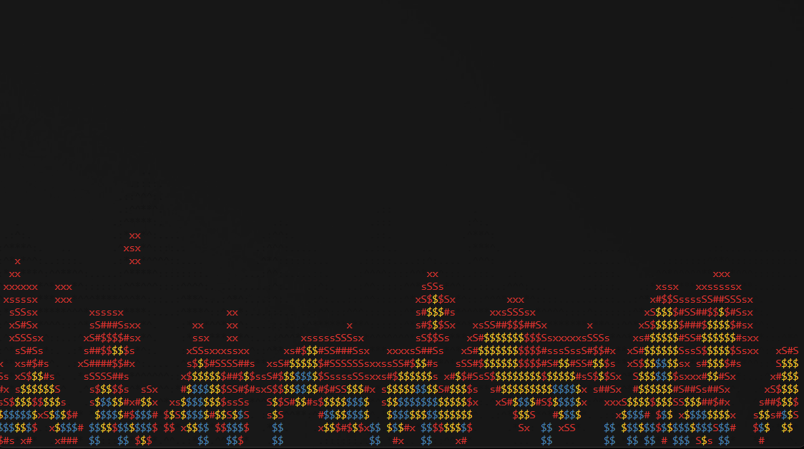 | alternative classic fire |
| `copper` | 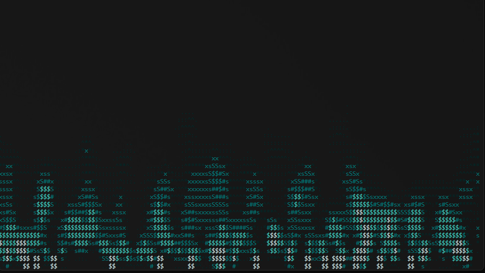 | turquoise copper-oxide flame |
| `crimson` | 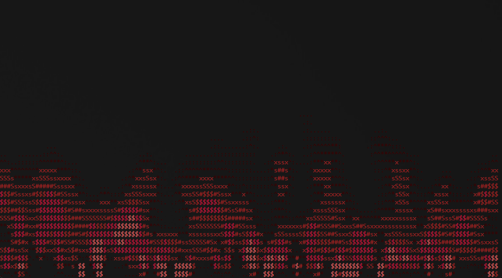 | aggressive crimson-red fire |
| `ember` | 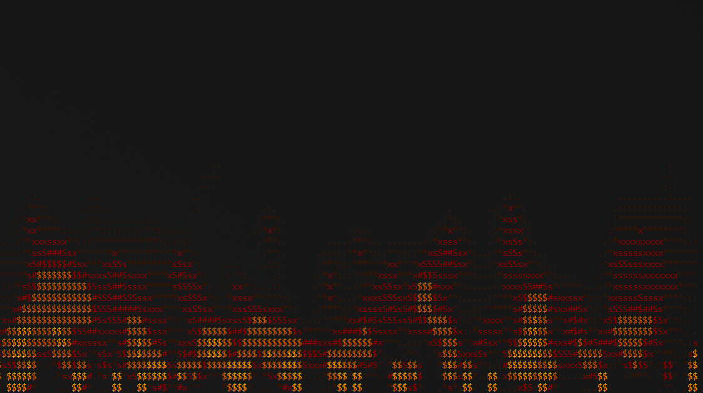 | glowing amber coals |
| `emerald` | 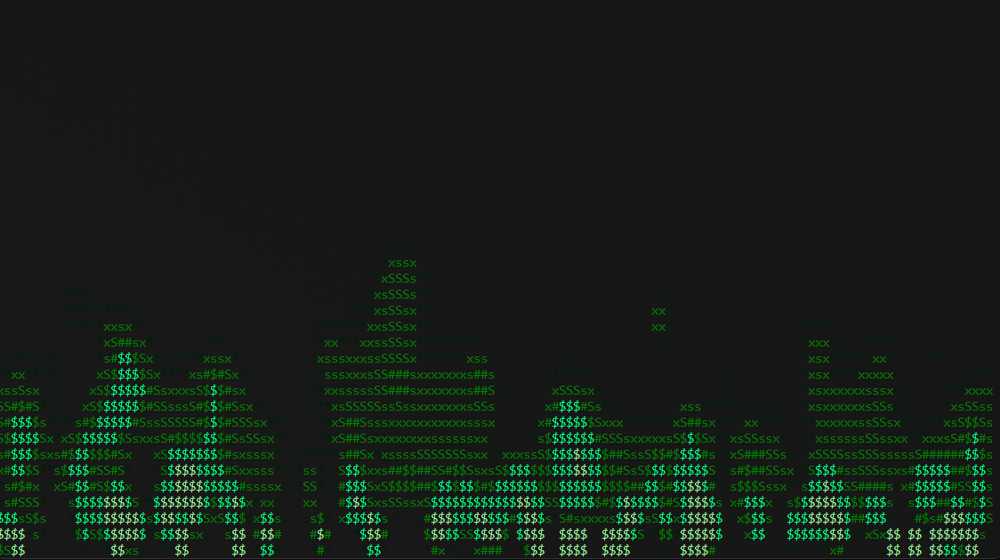 | deep emerald chemical fire |
| `forest` |  | mystical green fire |
| `ghost` | 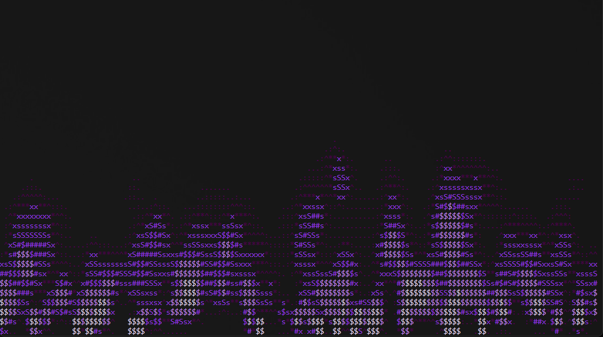 | ethereal violet magic flame |
| `gold` | 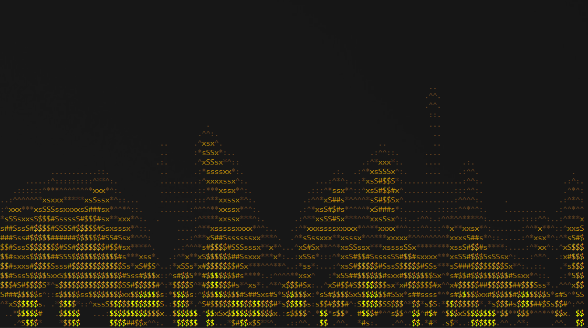 | luxury metallic golden shimmer |
| `ice` |  | ice fire |
| `magma` | 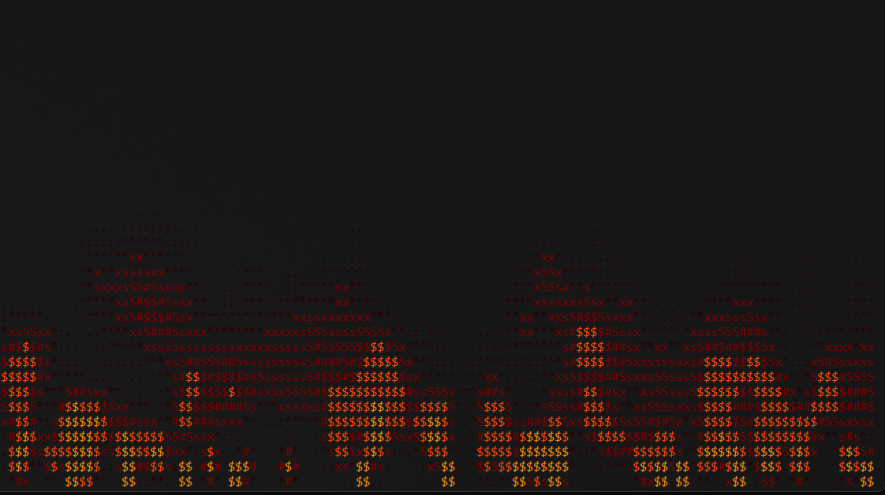 | viscous glow of molten lava |
| `nebula` | 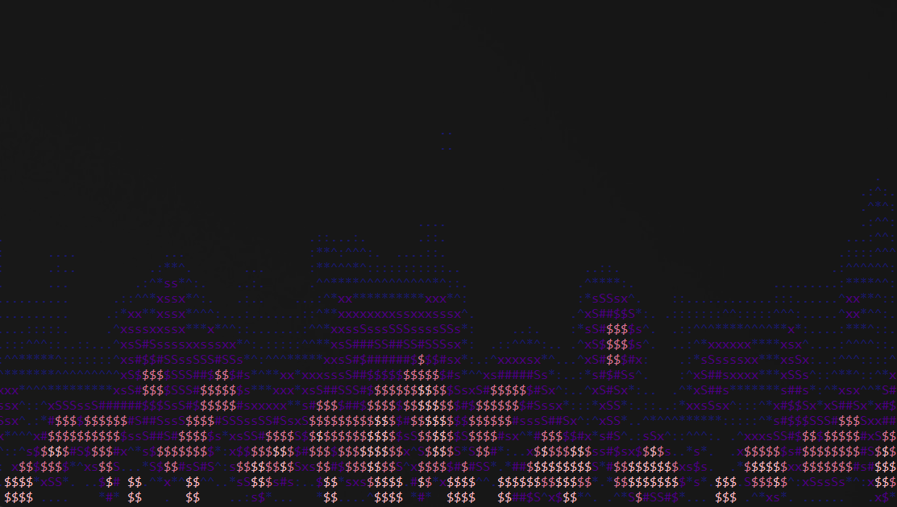 | cosmic pink & blue fire |
| `pink` | 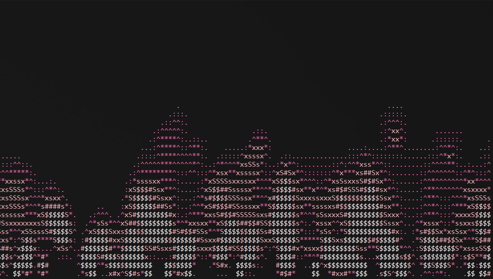 | pink neon fire |
| `plasma` | 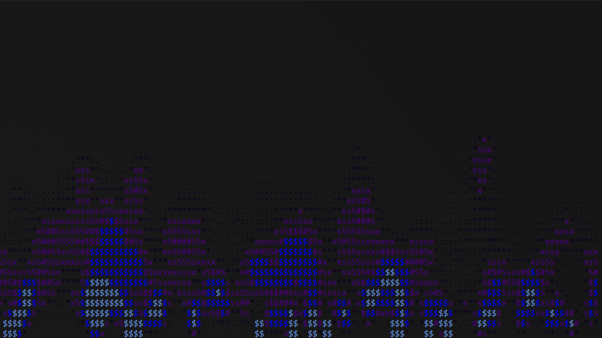 | electric indigo plasma |
| `rainbow` | 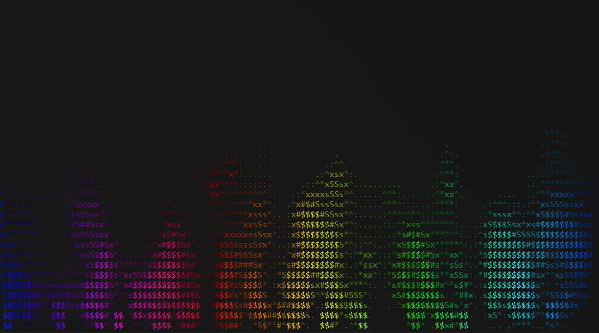 | multicolor spectrum fire |
| `solar` | 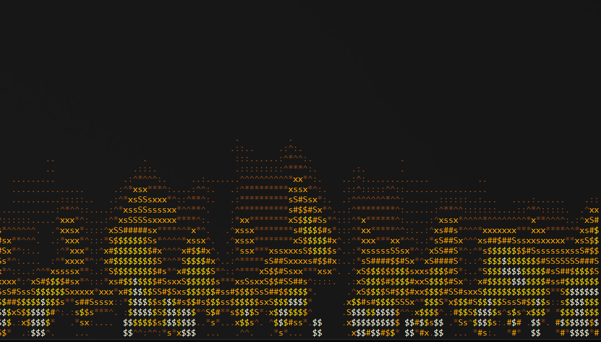 | blinding white-hot solar flares |
| `std` | 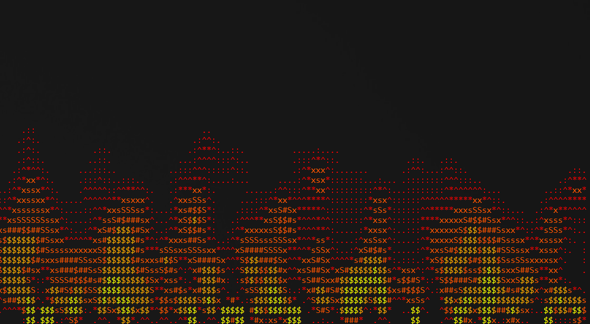 | classic fire |
| `sulfur` |  | ghostly blue flame |
| `custom` | — | use a user-defined theme |


>  Custom Theme Format: 
```
custom:#hex.#hex.#hex.#hex
```
>  Provide 1 to 4 HEX colors separated by dots (e.g., custom:\#ff0000.\#00ff00)

### 💡 Example Commands

```bash
fire-cli -f 60
fire-cli --theme copper --fps 45
fire-cli -t custom:#ff0055.#ffcc00.#ffffff
```

### ⌨️ Controls
* **ESC** or **Ctrl+C** — Exit the program.

---

## 📖 Contribution Guide

If you have any suggestions, fixes, or patches to share, feel free to:

- Open **Issues** and label them where possible, to make it easy to categorize features and bugs.
- If you've solved a problem or made valuable changes, open a **Pull Request** on GitHub.

---

<a name="captures"></a>
## 📷 Captures

### 🔹 Screenshots
<p align="center">
  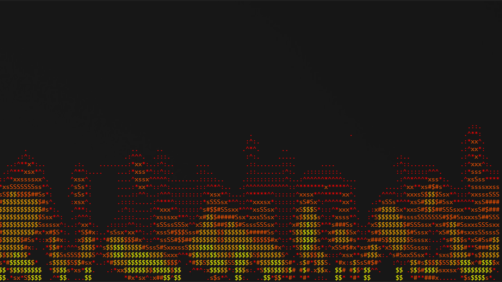
</p>

### 🔹 Screencasts
<p align="center">
  
</p>


---

## ⚡ Maintainers

- ➤ **Horizon** — <horizondebug@gmail.com>

<p align="center">
  <a href="https://xd_sergii.t.me">
    
  </a>
  <a href="https://github.com/horizonwiki">
    
  </a>
</p>

---

## 📄 License

This software is provided under the Apache License 2.0. [View License](./LICENSE)
